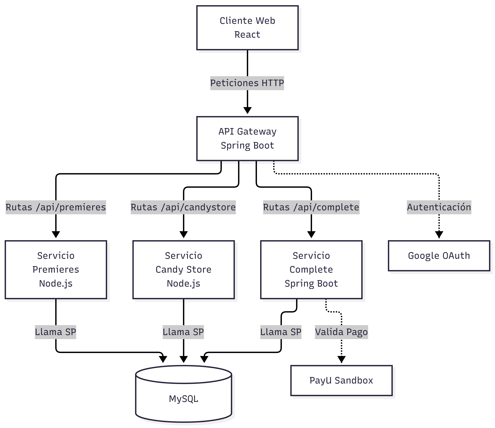

# Tienda de Dulcería Cineplanet - Prueba Técnica

Aplicación web para una tienda de dulcería de cine. Permite a los clientes visualizar la cartelera, autenticarse (o ingresar como invitados), seleccionar productos y realizar pagos integrados con el sandbox de PayU.

La solución está construida utilizando una arquitectura de microservicios con **React**, **Node.js** y **Java (Spring Boot)**, e incluye integración de pagos, autenticación con JWT, documentación con Swagger, procedimientos almacenados en MySQL y orquestación con Docker.

## 📐 Arquitectura del Sistema

El sistema utiliza un **API Gateway** y tres microservicios principales para distribuir las responsabilidades.



## 🚀 Flujo de Compra

1. **Home:** El servicio de cartelera (`premieres`) provee las películas en exhibición. Al seleccionar una, el usuario es redirigido al Login.
2. **Login:** El usuario puede autenticarse mediante correo/contraseña, Google OAuth, o ingresar como **Invitado**. 
    - Las sesiones autenticadas generan un token JWT. 
    - Los invitados acceden directamente sin generar sesión.
3. **Dulcería:** El servicio de dulcería (`candystore`) lista los productos y precios. El usuario arma su pedido y procede al pago.
4. **Pago:** El usuario ingresa sus datos y tarjeta. El servicio de pago (`complete`) procesa la transacción contra el sandbox de PayU. Si es aprobada, se ejecuta el procedimiento almacenado que registra la compra, y se devuelve un código de éxito (`0`) junto con el `transactionId`.

## ⚙️ Tecnologías Utilizadas

- **Frontend:** React, Vite, React Router.
- **Backend (API Gateway):** Java 11, Spring Boot 2.7, JWT, Swagger.
- **Microservicios (Lectura):** Node.js, Express, Winston (Logs).
- **Microservicio (Pago):** Java 11, Spring Boot 2.7, Integración PayU.
- **Base de Datos:** MySQL 8, Procedimientos Almacenados (Stored Procedures).
- **Infraestructura:** Docker, Docker Compose.

## 🐳 Ejecución con Docker

Se requiere tener Docker Desktop en ejecución. En la raíz del proyecto, ejecuta:

```bash
docker compose up --build
```

- **Tienda Web:** http://localhost:8088
- **Documentación Swagger:** http://localhost:8080/swagger-ui/index.html

*(Nota: MySQL en Docker expone el puerto `3307` para evitar conflictos con instalaciones locales en el puerto `3306`).*

Para detener los servicios, utiliza: `docker compose down`

## 💻 Ejecución Local (Sin Docker)

Requisitos: JDK 11, Node.js y MySQL 8.

1. Copia el archivo `.env.example` a `.env` y configura la contraseña de MySQL.
2. Inicializa la base de datos ejecutando los scripts en `db/init` en el siguiente orden:
   - `01_schema.sql`
   - `02_procedures.sql`
   - `03_seed.sql`
3. *(Opcional)* Para habilitar Google Login, configura `VITE_GOOGLE_CLIENT_ID` en `frontend/.env`.
4. Inicia los servicios:

```powershell
.\scripts\start-dev.ps1
```

La tienda estará disponible en http://localhost:5173.

## 🧪 Datos de Prueba

- **Usuario:** `cliente@cine.com`
- **Contraseña:** `cine123`
- **Tarjeta PayU (Aprobada):** `4907840000000005`, Expiración: `05/27`, CVV: `777`.
*(El botón "Tarjeta de prueba" en el formulario autocompleta estos datos).*

Para simular un rechazo por parte de PayU, utiliza la casilla de verificación en el formulario de pago. Esto interrumpirá el flujo para demostrar el manejo de errores sin guardar la compra.

## 🏗️ Decisiones de Diseño e Implementación

### Microservicios y API Gateway
Se implementaron tres microservicios específicos y un **API Gateway**:
- **Gateway (Spring Boot):** Punto de entrada único. Maneja el inicio de sesión, emisión/validación de JWT y expone la documentación Swagger.
- **Premieres & Candystore (Node.js):** Servicios ligeros de lectura que consumen procedimientos almacenados.
- **Complete (Spring Boot):** Servicio transaccional encargado de comunicarse con PayU y registrar la compra en base de datos. Se eligió realizar la llamada a PayU desde el backend por seguridad (no exponer llaves ni datos sensibles de tarjetas en el cliente).

### Autenticación y Seguridad
- Se utiliza **JWT** con una expiración de dos horas. 
- El login con **Google** se realiza validando el token del cliente contra los servidores de Google desde el Gateway, sin requerir almacenar `client_secrets` en el repositorio.

### Base de Datos y Stored Procedures
Se optó por **MySQL** para dar soporte a los procedimientos almacenados requeridos:
- Listado de cartelera.
- Listado de dulcería.
- Búsqueda de cuentas por correo.
- Registro transaccional de la compra (valida montos e idempotencia mediante el `transactionId` de PayU para evitar cobros duplicados).

Se incluye una prueba automatizada del procedimiento de compra en `db/pruebas/prueba_del_procedimiento_de_compra.sql`.

### Trazabilidad (Logs)
Todos los servicios implementan logging estructurado (Winston en Node.js, Spring Logging en Java) incluyendo un identificador de trazabilidad que viaja desde el Gateway hasta los microservicios.

## 📁 Estructura del Proyecto

- `frontend/`: Aplicación cliente en React.
- `gateway/`: API Gateway en Spring Boot (Login, JWT, Swagger).
- `services/premieres/`: Microservicio Node.js (Cartelera).
- `services/candystore/`: Microservicio Node.js (Dulcería).
- `services/complete/`: Microservicio Spring Boot (Pagos PayU).
- `db/init/`: Scripts de creación de esquemas, procedimientos y datos semilla.
- `db/pruebas/`: Pruebas de base de datos.
